# CarBook Project

CarBook is a web application where car rental transactions are performed, car prices are listed, and detailed information about cars can be obtained. This application is developed using ASP.NET Core 8. In the backend, a Web API is built using Onion, CQRS, and Mediator patterns. MSSQL is used as the database. Additionally, Identity structure is integrated for user and role authorizations.

## Features

- Adding, updating, and deleting cars
- Car rental transactions
- Determining car prices
- Getting detailed information about cars
- Blog-like details
- Admin panel

## Technologies Used

### Backend
- **ASP.NET Core 8:** The framework used on the backend.
- **Onion, CQRS, and Mediator Patterns:** Used to organize the business logic within the project.
- **MSSQL:** Preferred as the database.
- **Identity:** Integrated for user and role authorizations.
- **AutoMapper:** Used for object-to-object mapping.

### Frontend
- **MVC (Model-View-Controller):** The architecture used on the frontend.
- **HTML, CSS, JavaScript:** Basic technologies for the website.

## Project Structure

The project follows the Onion architecture. The core layers are as follows:

- **Core:** Contains fundamental entities and business logic rules.
- **Infrastructure:** Contains database operations and external services.
- **Application:** Applies the business logic and interacts with the external world.
- **Web API:** The layer providing RESTful API and handling requests.
- **Web UI:** The MVC side, creating and presenting the user interface.
- **Admin Panel:** A separate section for the admin interface.

## Screenshots

### Home Page and Other Pages

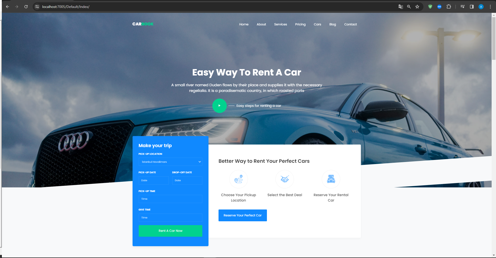
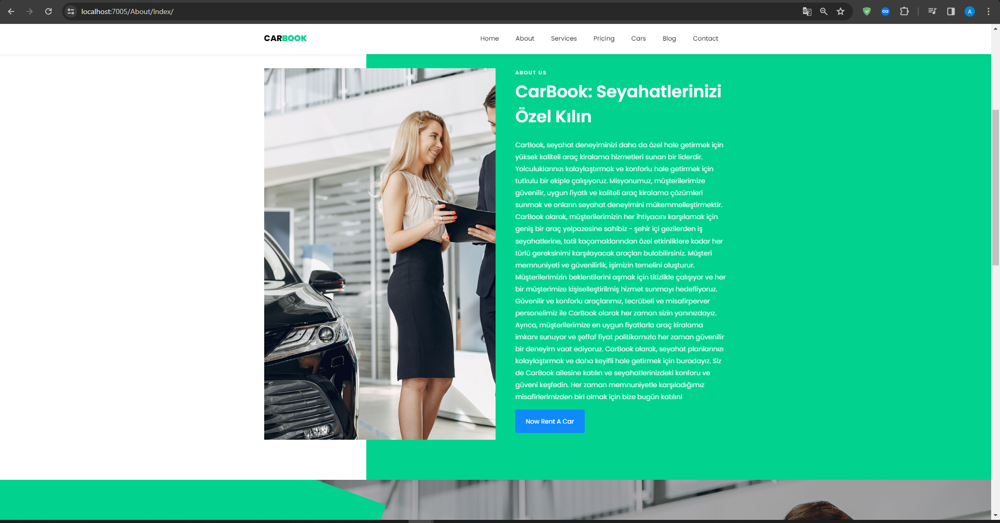
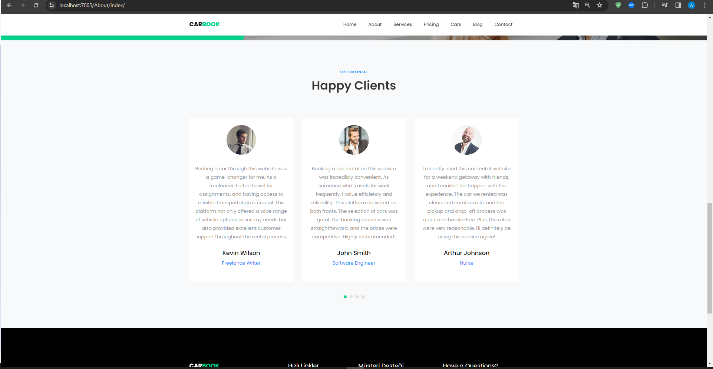
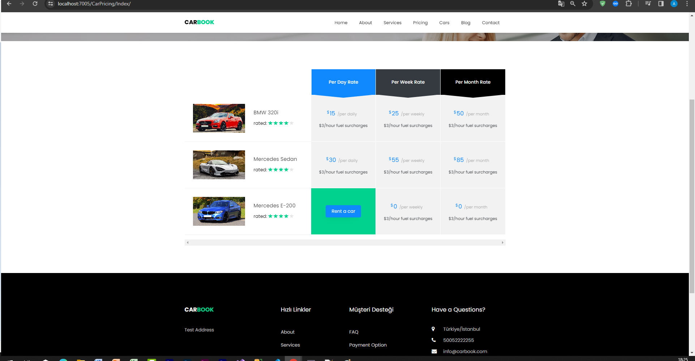
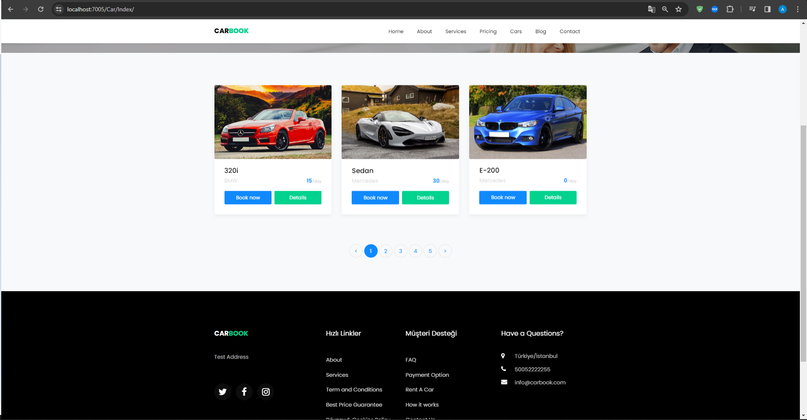
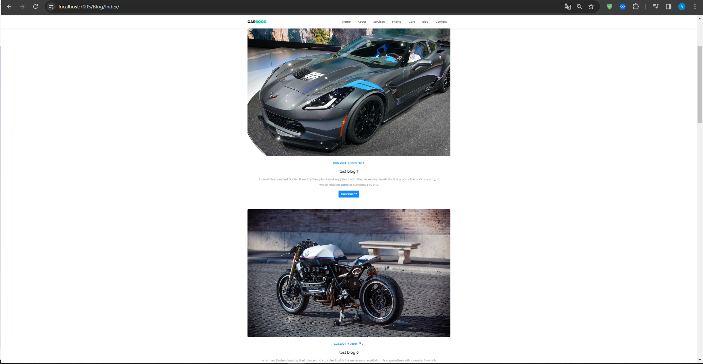
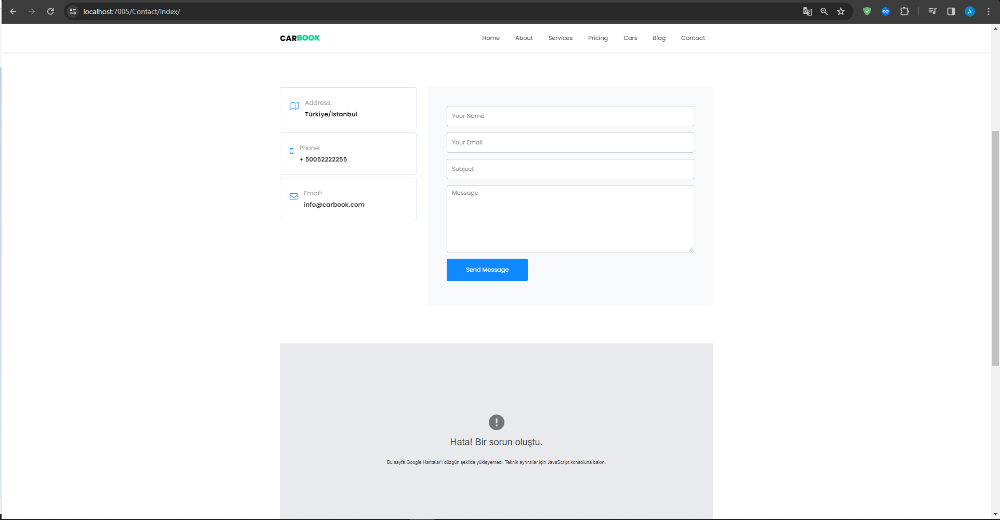

### Admin Panel

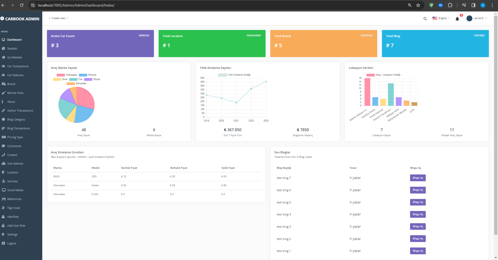
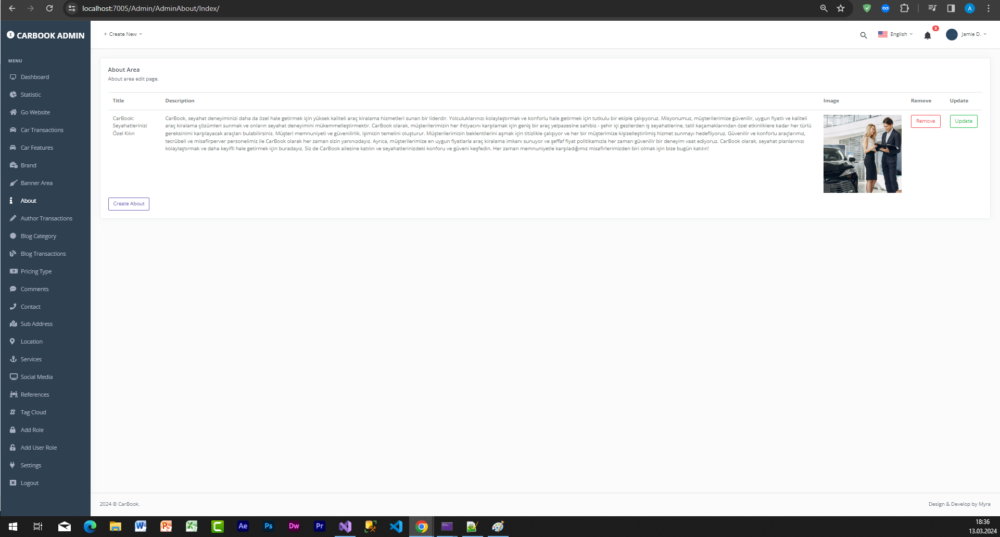
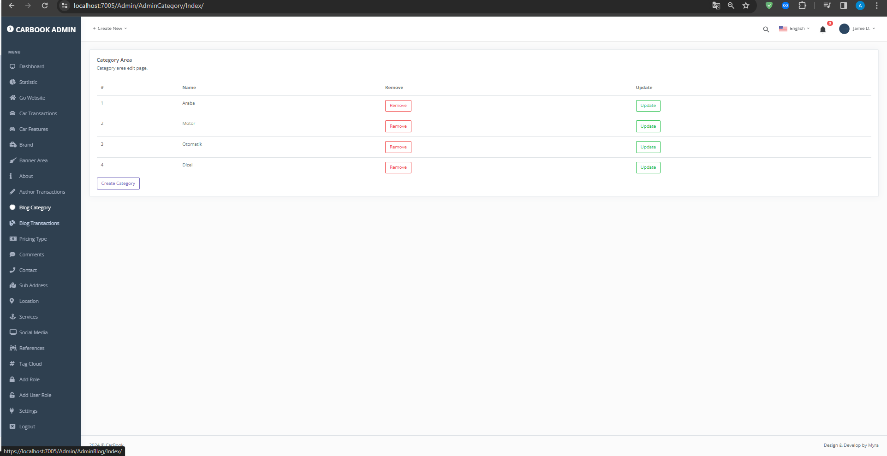
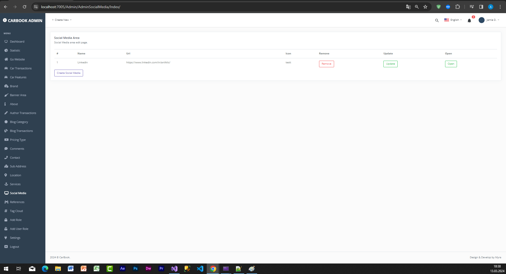
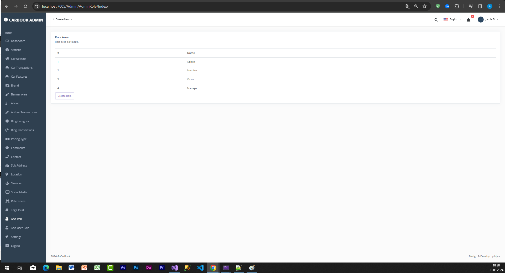
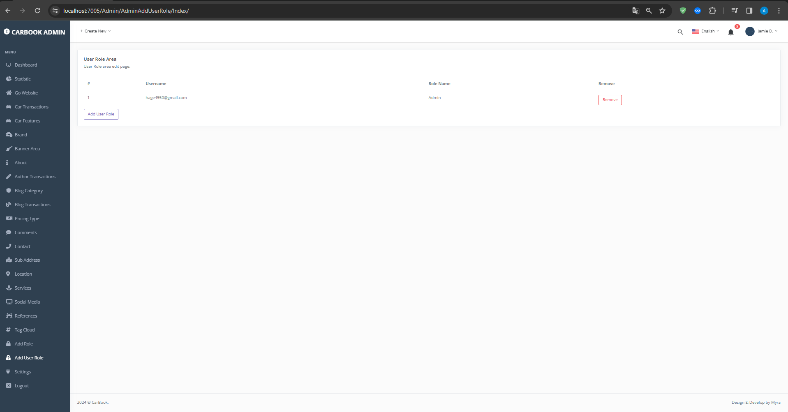
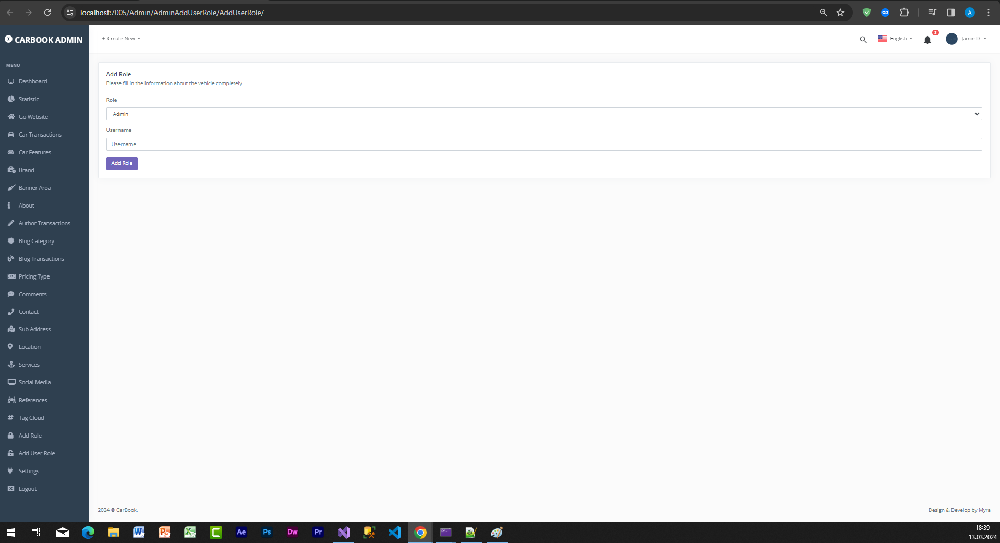

### Swagger Screenshots

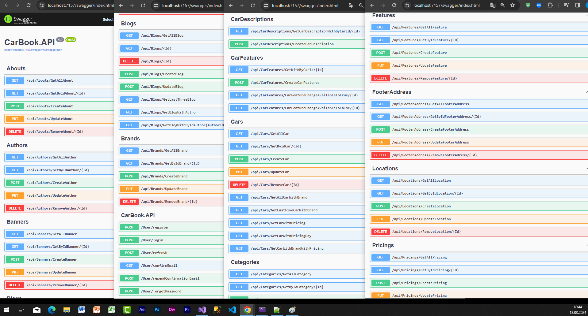
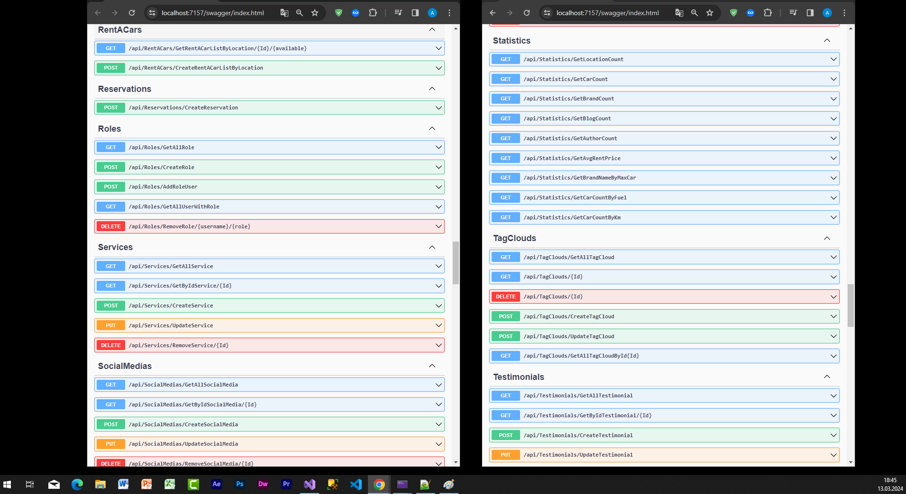

## Installation

1. Clone the project: `git clone https://github.com/anilklc/CarBook.git`
2. Open the project with Visual Studio or Visual Studio Code.
3. Update the database connection string in the `appsettings.json` file.
4. Open the Package Manager Console or Terminal.
5. Run the following commands to get the migrations and create the database:
   ```bash
   dotnet ef migrations add InitialMigration
   dotnet ef database update
6. Build and run the project.


## Requirements
- .NET Core SDK
- MSSQL Server

## License
MIT License
